# Phase 1 - Requirements Engineering

## Introduction

An online university requires the development of a payment system for their students and staff. They wish for compatibility with their existing systems and for a report generator within the system for easy access to aggregate data. They expect this to be delivered on the 23rd of March. This project's development will follow a plan-driven waterfall model, which will be explained in the next section.

## Task Allocation Table

|Name| Git Username | Gre username| task |
|---|---|---|---|
|Warwick|janOliku|wm2109c|Introduction|
|Warwick|janOliku|wm2109c|System requirements specification|
|Warwick|janOliku|wm2109c|User requirements definition|
|Chris|chrisreilly706|cr6314|Software Process Model|
|Chris|chrisreilly706|cr6314|A Gantt chart of the project  plan|
|Juan | jjuanda19 | jg8115y|Glossary|
|Juan | jjuanda19 | jg8115y|Possible risks and risk planning|
|Juan | jjuanda19 | jg8115y|References and Acknowledgements |

## SOFTWARE PROCESS MODELS 

### What is a software process model?

A software process model is a list of activities that are completed in order to complete the development of a software system. There are two main types of software process models, the first of which is plan driven. A plan driven software process model is when all activities are planned in advanced and systematically completed until the job is done. On the other hand, an agile driven process model is when tasks are completed in stages/groups but are easily changed in order to adhere to the customers specifications  

**Plan-driven** is best used for systems that need a high safety aspect as detailed records are kept at each stage in the process.

**Agile-driven** process model is best used for business that constantly need to adapt to changes in their plans.

The system process model that our group has decided to go with is plan-driven. Giving that we are making a payroll system that would have to store the banking details of many students, security is a high priority for our system. Therefore, we believe a plan driven system to best suited for our situation as keeping accurate records is easiest in this format.

The type of plan-driven process model that we are going with is a water-fall model. A water-fall model has separate and distinct phases of specification and development. The water-fall model has six different fixed-order phases.

*Requirements analysis – the systems requirements and uses are taken from the customers the system is intended for* 

*System design – a basic design of the overall system and how it will be laid out* 

*Implementation – the development of the system and its software begin*

*(Unit) testing – testing each unit verifying that all parts of the software reaches the needed specification* 

*Deployment - the system is installed and put into practical use*

*Maintenance - involves correcting errors, improving the implementation, and enhancing the system’s services as new requirements are discovered.*

### Advantages of a water fall model

- *As it is a plan driven model it is quite simple in its process, meaning it is step by step*

- *waterfall models are very reliable for safety critical systems as it is capable of keeping accurate records at each stage*

### Disadvantage of waterfall model

- *Once an application is in the testing stage, it is very difficult to go back and change something that was not well-thought out in the concept stage*

- *It takes longer to create a working model using plan-driven waterfall than more agile processes*

- *The waterfall model does come with high risk as it does not allow for a margin of error as it is such a rigid process model. It does not account for mistakes*

- *Not a good model for businesses that would require complex systems that revolve around change*  

- *Poor model for long and ongoing projects*

Attached is URL which shows an example of a water-fall process model.

 

## Glossary

### Git:
 
Git, a version control system used to monitor changes in computer files, is a highly regarded tool among programmers all around the world. Any particular project may be handled with Git.

This software allows users to organize and coordinate workflow in a project team and track the progress of each team member over time. It allows many users to work at the same time without interfering with each other’s works.

### GitHub: 
It is a git repository hosting service which offers a web-based graphical interface. It is the biggest coding community. Programmers may discover source code in a variety of languages.

GitHub enables any team member to collaborate and work on a project from any place. You may also look at prior versions that were made at different points in time.
It is used by project managers and developers to organise, track, and update their work in order for projects to be transparent and on time. Packages can also be distributed secretly, internally inside the team, or openly to the open-source community who will get the packages from GitHub.

### Markdown: 

Markdown is a quick and simple markup language that you may use to add formatting components to plaintext text documents. In order to specify which words and phrases should have a distinct appearance in a document that has been prepared in Markdown, you must add Markdown syntax to the text.

It’s possible to add Markdown formatting elements to a plaintext file using a text editor application. Websites, papers, notes, publications, presentations, emails, and technical documentation are all produced with it.
It is portable. The majority of programmes can open files using Markdown text formatting.

It is cross-platform, meaning that Markdown-formatted content may be created on any device running any operating system.

### Mermaid:

 Mermaid is a tool for creating complex diagrams in Markdown using simple instructions and an easy syntax. It’s not necessary to draw anything; only write it out.

Flowcharts may be used to help you comprehend algorithms, Gantt charts for project management, pie charts, and a variety of other popular diagram forms.

Mermaid intelligently arranges the diagram for us, so there is no need to re-arrange all of the elements if, for example, an intermediate step is forgotten in a flowchart.

### Visual Studio Code: 
It is one of the fastest source code editors. It has support for hundreds of languages (C++, C#, Java, Python, etc) that is a really useful tool for help with highlighting, bracket-matching, auto-indentation, box-selection, snippets, and more.
### Software: 
A set of instructions, data, or programmes used to run computers and carry out specified activities. Is a generic term used to refers to applications, scripts, and programmes that run on a device. It can be viewed as the variable component of a computer.
### Hardware:

The physical components of a computer are unchangeable characteristics of the system, such as the CPU, storage, keyboard or mouse.

### GDPR :
 
General Data Protection Regulation, which went into effect on May 25, 2018, offers a legal framework for protecting everyone's personal data by requiring businesses to have rigorous protocols in place for managing and storing personal data. It is also intended to safeguard us from being approached by organisations without our express approval.

### P45:  

It is got when someone stops working for a company. P45 is a document that reveals how much tax it has been paid so far by someone in a tax year,  from the 6th of April to the 5th of April.

### P60:
 
It is a document that shows how much tax people has paid tax it has been paid so far by someone in a tax year,  from the 6th of April to the 5th of April. People may get a separate P60 for each of their jobs every tax year.

### BACS:

  BACS payment is a bank-to-bank transfer. Bacs payment methods are divided into two categories, which are characterised by:
Direct Debit: When you give another party permission to take money from your bank account. Direct Debits include payments such as your monthly council tax, internet bill, and power bill, among other things.
Direct Credit: This is when someone else sends money into your account, often known as a "bank transfer." Direct Credits include refunds, salary payments, and pension payments.

### Two-Factor Authentication:

 Two Factor Authetication (2FA) is a security mechanism that necessitates the use of two unique forms of identification in order to get access to anything.
Two-factor authentication can help to secure an internet account, a smartphone, or even a door. 2FA does this by asking the user to provide two forms of information —a password or personal identification number (PIN), a code texted to the user's smartphone, or a fingerprint— before accessing whatever is being secured.

### C# dotNET framework:
 
Microsoft's .NET Framework is a general-purpose development platform. It is the most widely used method for developing client and server applications for Windows and Windows Server. It comes as part of Windows, Windows Server, and Windows Server Core. Server technologies including ASP.NET Web Forms, ASP.NET MVC, and Windows Communication Foundation (WCF) apps are included. Automatic memory management, (runtime) generic types, reflection, asynchrony, concurrency, and native interop are all features of NET that make programming easier. Millions of developers use these features to quickly create high-quality web and client apps.
C# is a simple, powerful, type-safe, object-oriented programming language that retains the expressiveness and beauty of C-style languages.

## User Requirements Definition

The User (currently Finance Administrator Seb Blair) requires the following features to be developed within this payment system:

1. Students must be able to submit tuition payments and recieve invoices.
2. Staff (lecturer) payroll and payslips must be generated and managed.
3. Reports must be able to be generated to access overall data including income, expenses and student records.
4. This system must be compatible with the other systems used by the University, including abiding by security regulations.

## System Requirements Specification

1. 1. Students must be able to make tuition payments directly through the system, ensuring that various payment methods are available, including Visa and MasterCard.
    2. Invoices for these payments will be generated and stored on the system database, and will be accessible to the students and the Finance Administrator through the system.
    3. Students must also be able to submit notification of Student Loan payments in order to fund their studies.
2. 1. The system will show current and rolling hour counts for staff in order for the Finance Administrator to verify and confirm pay calculations
    2. The system, upon the Finance Administrator's verification, will calculate pay and generate payslips for all staff who are owed wages in the current payment period. 
    3. Payslips will be able to be generated from any past data range, in case an error causes payslips to be incorrect, or in case a final calculation is needed for P45 or P60 HMRC tax purposes.
    4. The system will pay the staff using BACS based on the aforementioned payslip data.
3. 1. Reports of income (primarily tuition), expenses (wages and teaching materials) and total profit will be generated upon the Finance Administrator's request in order to view overall financial data.
    2. Reports of student records (grades, attendance, academic status, etc) will be generated upon the Finance Administrator's request in order to view overall academic data.
4. 1. The system will use existing student login data from the main database, and should sync data between this database and itself to integrate itself into the existing systems.
    2. The system will utilise Two Factor Authentication upon all login attempts as well as minimum password security requirements to adhere to GDPR regulations.
    3. The system will use an alphanumeric identifier for all students in the format of their initials followed by a random 4 digit number (aa000).
    4. The system will be programmed in C# using the dotNET framework for compatibility between this system and the other university systems.

## Possibles risks and risk planning
| Risk | Risk Type | Probability |Effects| Affects|Description | Strategy|
|---|---|---|---|---|---|---|
| Someone from the team may not achieve the submission date| People | Moderate |Serious| Project and Product| As a system has been chosen which depends on the progress of each stage, it is possible to cause several delays to the delivery date of the project and product| Every week check the progress of the project and if somebody does not accomplish the first two target dates established, reorganize the project. This could mean more work for the team members|
|Team member absence/illness at critical moments| People| Moderate |Serious|Project and Product| If people get sick at important moments it will delay the final product delivery date which could cost several marks on this project|As soon as notified, the absentee will necessitate a reorganization of the project and the rest of the team need to finish it|
|Lack of preparation| People | Likely | Critical | Product| Due to all team members currently being in undergraduate education it is very likely that the team will struggle with aspects of software and coding with which they are not yet familiar |Prepare the team by getting acquainted with the coding software through the labs and coursework and follow the professor’s guidance to avoid mistakes|
|Lack of software access| Software| Moderate|Severe|Product| Team members may not have access to a good enough computer that allows them to work from home, or they are not able to work from home| Work from the computers in the Nelson building, if this is not possible they should contact their colleagues who have the necessary software for submitting|
System does not respond as expected|Software|Almost Certain| Severe| Product|Team members are not experts, and most of the time that the system is being tested it is expected to fail. It is important for the project to not fail at an advanced stage as it is difficult to take a step back due to the water-fall model| Ensure that the project is double-checked before continuing to the next stage in development.|

## *Gantt chart*
a Gantt chart is a work production tool that is used to keep track on the work done my specific member of the team and as a whole. A gantt chartt is usefull for a few reason one of wehich is alloting certain periods of time to each task to ensure completion upon the deadline 

our Gantt chart is representation of what task we had to complete as individuals of the groups and i what oder we completed them 

### References

 Docker Hub. Available at: https://hub.docker.com/_/microsoft-dotnet-framework (Accessed: December 7, 2022). 

Brilliantly simple guide to the GDPR: BPE Solicitors) BPE Solicitors. Available at: https://www.bpe.co.uk/for-business/regulatory/data-protection/brilliantly-simple-guide-to-the-gdpr/ (Accessed: December 6, 2022). 

Gaba, I. (2022) What is github and how to use it? ,Simplilearn.com. Simplilearn. Available at: https://www.simplilearn.com/tutorials/git-tutorial/what-is-github#what_is_git (Accessed: December 5, 2022). 

Getting started (no date) Markdown Guide. Available at: https://www.markdownguide.org/getting-started/#what-is-markdown (Accessed: December 5, 2022). 
Kenton, W. (2022) What is Two-factor authentication (2FA)? how it works and example, Investopedia. Investopedia. Available at: https://www.investopedia.com/terms/t/twofactor-authentication-2fa.asp (Accessed: December 7, 2022)
 
Souly, A. (2021) Mermaid: Create diagrams quickly and effortlessly, Medium. Towards Data Science. Available at: https://towardsdatascience.com/mermaid-create-diagrams-quickly-and-effortlessly-d236e23d6d58#:~:text=Mermaid%20is%20a%20tool%20that,what%20you%20want%20to%20see! (Accessed: December 5, 2022). 
Welcome to gov.uk  Welcome to GOV.UK. Available at: https://www.gov.uk/ (Accessed: December 7, 2022). 

What is bacs? guide to bacs payments (no date) Starling Bank. Available at: https://www.starlingbank.com/resources/banking/what-is-bacs-guide-to-bacs-payments/ (Accessed: December 7, 2022). 

***Thanks to our module leader Sebastian Blair for his lessons and support, which were really helpul for us to make this report***.
