# Phase 1 - Requirements Engineering

## Introduction

An online university requires the development of a payment system for their students and staff. They wish for compatibility with their existing systems and for a report generator within the system for easy access to aggregate data. They expect this to be delivered on the 23rd of March. This project's development will follow a plan-driven waterfall model, which will be explained in the next section.

## Task Allocation Table

|Name| Git Username | Gre username| task |
|---|---|---|---|
|Warwick|janOliku|wm2109c|Introduction|
|Warwick|janOliku|wm2109c|System requirements specification|
|Warwick|janOliku|wm2109c|User requirements definition|
|Chris|chrisreilly706|cr6314|Software Process Model|
|Chris|chrisreilly706|cr6314|A Gantt chart of the project  plan|
|Juan | jjuanda19 | jg8115y|Glossary|
|Juan | jjuanda19 | jg8115y|Possible risks and risk planning|
|Juan | jjuanda19 | jg8115y|References and Acknowledgements |

## SOFTWARE PROCESS MODELS 

### What is a software process model?

A software process model is a list of activities that are completed in order to complete the development of a software system. There are two main types of software process models. The first of which is plan driven. A plan driven software process model is when all activities are planned in advanced and systematically completed until the job it done. An agile driven process model is when tasks are completed in stages/groups but are easily changed in order to change to the customers specifications  

**Plan-driven** is best used for systems that need a high safety aspect as detailed records are kept at each stage in the process. 

**Agile-driven** process model is best used for business that constantly need to adapt to change in their plans 

The system process model that our group has decided to go with is a plan-driven. Giving that we are making a payroll system that would have to store the banking details of many students, security is a high priority for our system. Therefore, we believe a plan driven system to best suited for our situation as keeping accurate records is easiest in this format 

The type of plan-driven process model that we are going with is a water fall model. A water-fall model has separate and distinct phases of specification and development. The water fall model has six different phases in order from first to be done to last to be done.

*Requirements analysis – the systems requirements and use are taken from the customers the system is intended for* 

*System design – a basic design of the overall system and how it will be laid out* 

*Implementation – the development of the system and its software start*

*(Unit) testing – testing each unit verifying that all part of the software reaches the needed specification* 

*Deployment - the system is installed and put into practical use*

*Maintenance - involves correcting errors, improving the implementation, and enhancing the system’s services as new requirements are discovered.* 

### Advantages of a water fall model 

- *As it is a plan driven model it is quite simple in its process, meaning it is step by step* 

- *waterfall models are also very reliable for safety critical systems as it is capable of keeping accurate records at each stage*

### Disadvantage of waterfall model

- *Once an application is in the testing stage, it is very difficult to go back and change*  

- *something that was not well-thought out in the concept stage.* 

- *It takes longer to create a working model using plan driven waterfall then the like of an agile process* 

- *The waterfall model does come with high risk as it does not allow for a margin of error as it is such a rigid process model it does not account for mistakes* 

- *Not a good model for business that would require complex system that revolve around change*  

- *Poor model for long and ongoing projects*

Attached is URL which shows an example of a water-fall process model 

 

 
## GLOSSARY
### Git:
 
Git, a version control system used to monitor changes in computer files, is a highly regarded tool among programmers all around the world. Any particular project may be handled with Git.

This software allows users to organize and coordinate workflow in a project team and track the progress of each team member over time. It allows many users to work at the same time without interfering with each other’s works.

### GitHub: 
It is a git repository hosting service which offers a web-based graphical interface. It is the biggest coding community. Programmers may discover source code in a variety of languages.

GitHub enables any team member to collaborate and work on a project from any place. You may also look at prior versions that were made at different points in time.
It is used by project managers and developers to organise, track, and update their work in order for projects to be transparent and on time. Packages can also be distributed secretly, internally inside the team, or openly to the open-source community. Getting the packages from GitHub

### Markdown: 

Markdown is a quick and simple markup language that you may use to add formatting components to plaintext text documents. In order to specify which words and phrases should have a distinct appearance in a document that has been prepared in Markdown, you must add Markdown syntax to the text.

It’s possible to add Markdown formatting elements to a plaintext file using a text editor application. Websites, papers, notes, publications, presentations, emails, and technical documentation are all produced with it. 
It is portable. The majority of programmes may be used to open files using Markdown text formatting.

It is cross-platform, meaning that Markdown-formatted content may be created on any device running any operating system.

### Mermaid:

 Mermaid is a tool for creating complex diagrams in Markdown using simple instructions and an easy syntax. It’s not necessary to draw anything; only write it out.

Flowcharts may be used to help you comprehend algorithms, Gantt charts for project management, pie charts, and a variety of other popular diagram forms.

Mermaid intelligently arranges the diagram for us, so not needed to re-arrange all the boxes if it is forgotten a middle step in a flowchart.

### Visual Studio Code: 
It is one of the fast source code editors. It has support for hundreds of languages( as C++, java and phyton ) that is a really useful tool for help with highlighting, bracket-matching, auto-indentation, box-selection, snippets, and more.
### Software: 
A set of instructions, data, or programmes used to run computers and carry out specified activities. Is a generical term used to refers to Apps, scripts, and programmes that run on a device. It can be compared to the variable component of a computer.
### Hardware:
It is the physical characteristics of a computer is the unchangeable component as the cpu,keyboard or mouse.

## User Requirements Definition

The User (currently Finance Administrator Seb Blair) requires the following features to be developed within this payment system:

1. Students must be able to submit tuition payments and recieve invoices.
2. Staff (lecturer) payroll and payslips must be generated and managed.
3. Reports must be able to be generated to access overall data including income, expenses and student records.
4. This system must be compatible with the other systems used by the University, including abiding by security regulations.

## System Requirements Specification

1. 1. Students must be able to make tuition payments directly through the system, ensuring that various payment methods are available, including Visa and MasterCard.
    2. Invoices for these payments will be generated and stored on the system database, and will be accessible to the students and the Finance Administrator through the system.
    3. Students must also be able to submit notification of Student Loan payments in order to fund their studies.
2. 1. The system will show current and rolling hour counts for staff in order for the Finance Administrator to verify and confirm pay calculations
    2. The system, upon the Finance Administrator's verification, will calculate pay and generate payslips for all staff who are owed wages in the current payment period. 
    3. Payslips will be able to be generated from any past data range, in case an error causes payslips to be incorrect, or in case a final calculation is needed for P45 or P60 HMRC tax purposes.
    4. The system will pay the staff using BACS based on the aforementioned payslip data.
3. 1. Reports of income (primarily tuition), expenses (wages and teaching materials) and total profit will be generated upon the Finance Administrator's request in order to view overall financial data.
    2. Reports of student records (grades, attendance, academic status, etc) will be generated upon the Finance Administrator's request in order to view overall academic data.
4. 1. The system will use existing student login data from the main database, and should sync data between this database and itself to integrate itself into the existing systems.
    2. The system will utilise Two Factor Authentication upon all login attempts as well as minimum password security requirements to adhere to GDPR regulations.
    3. The system will use an alphanumeric identifier for all students in the format of their initials followed by a random 4 digit number (aa000).
    4. The system will be programmed in C# using the dotNET framework for compatibility between this system and the other university systems.
